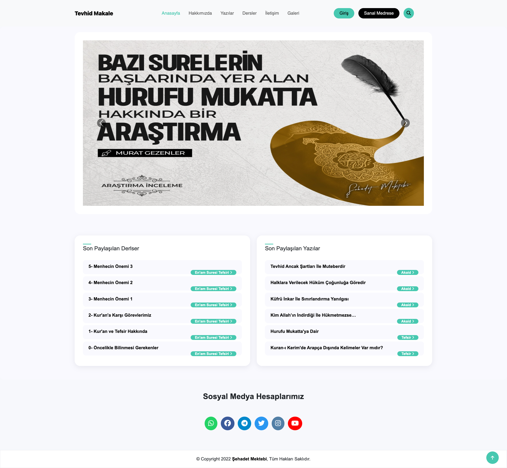
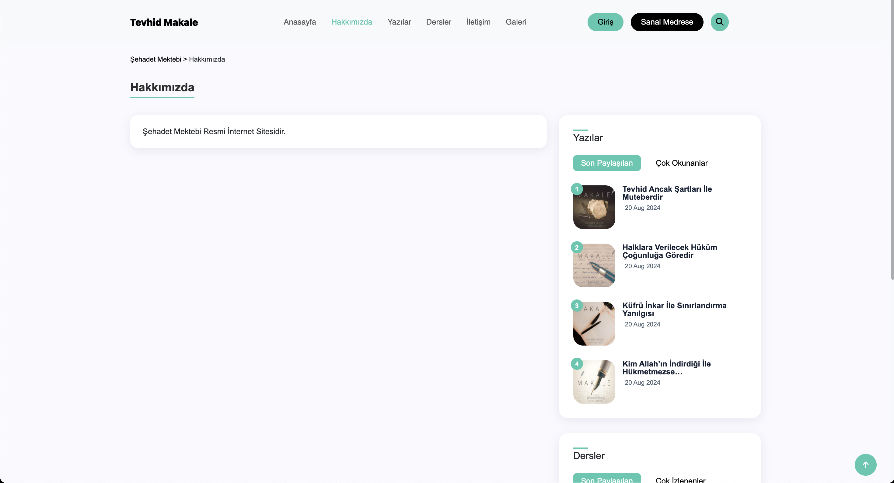
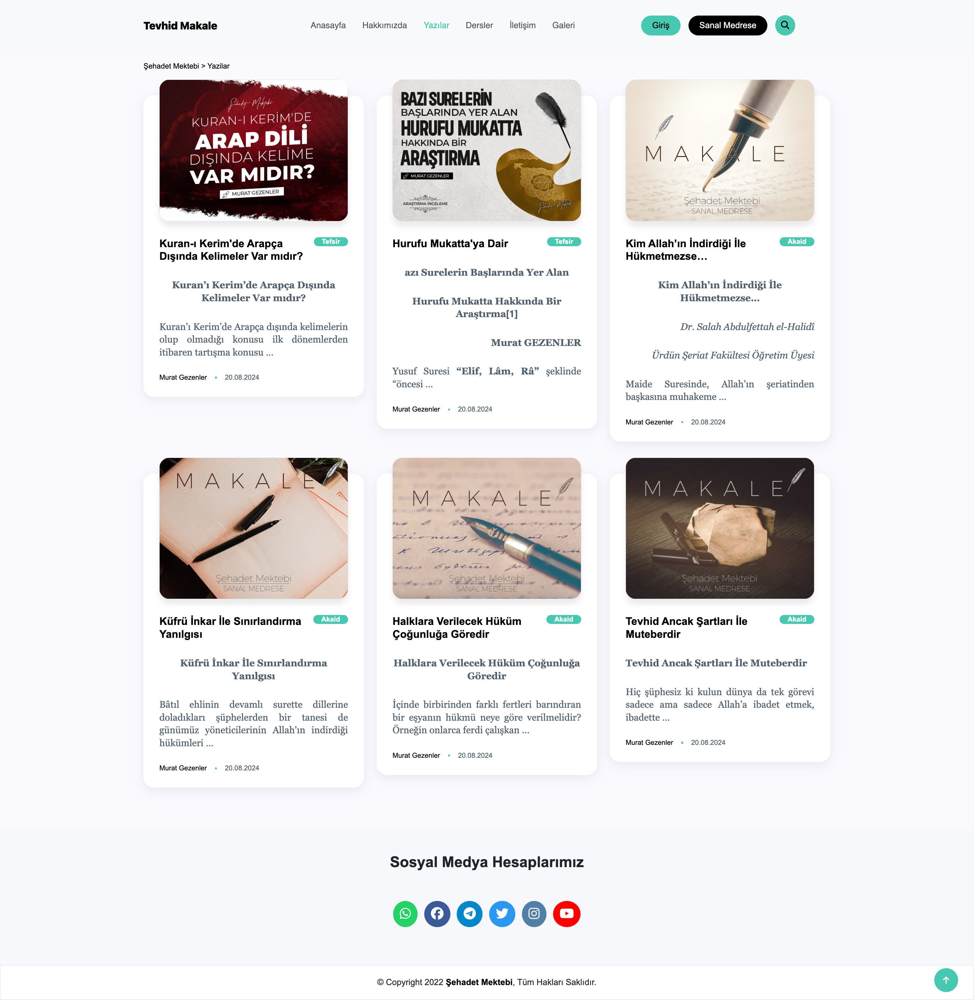
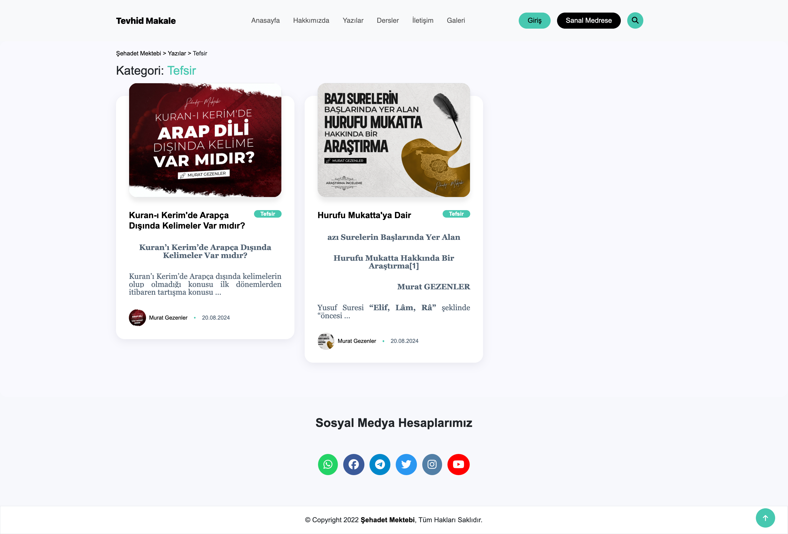
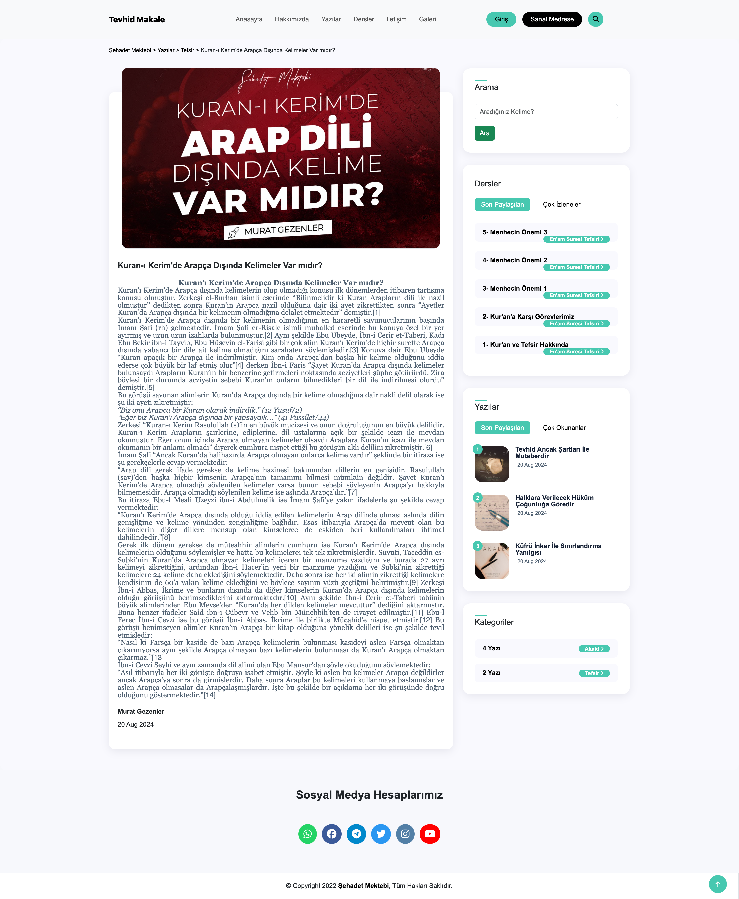
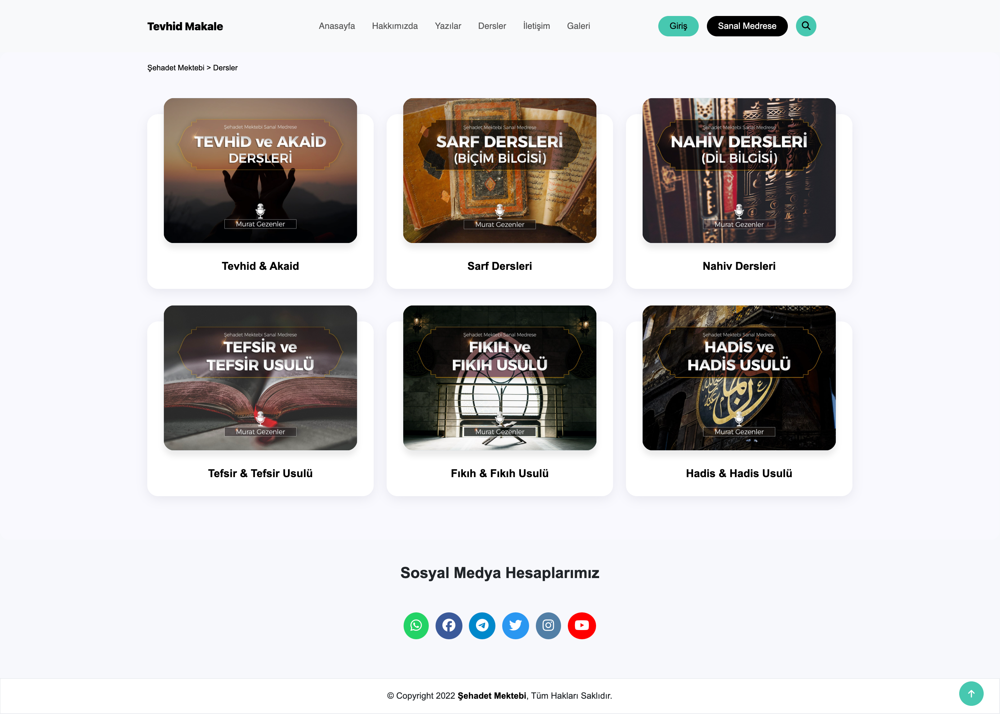
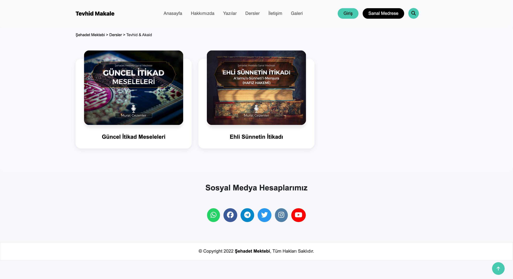
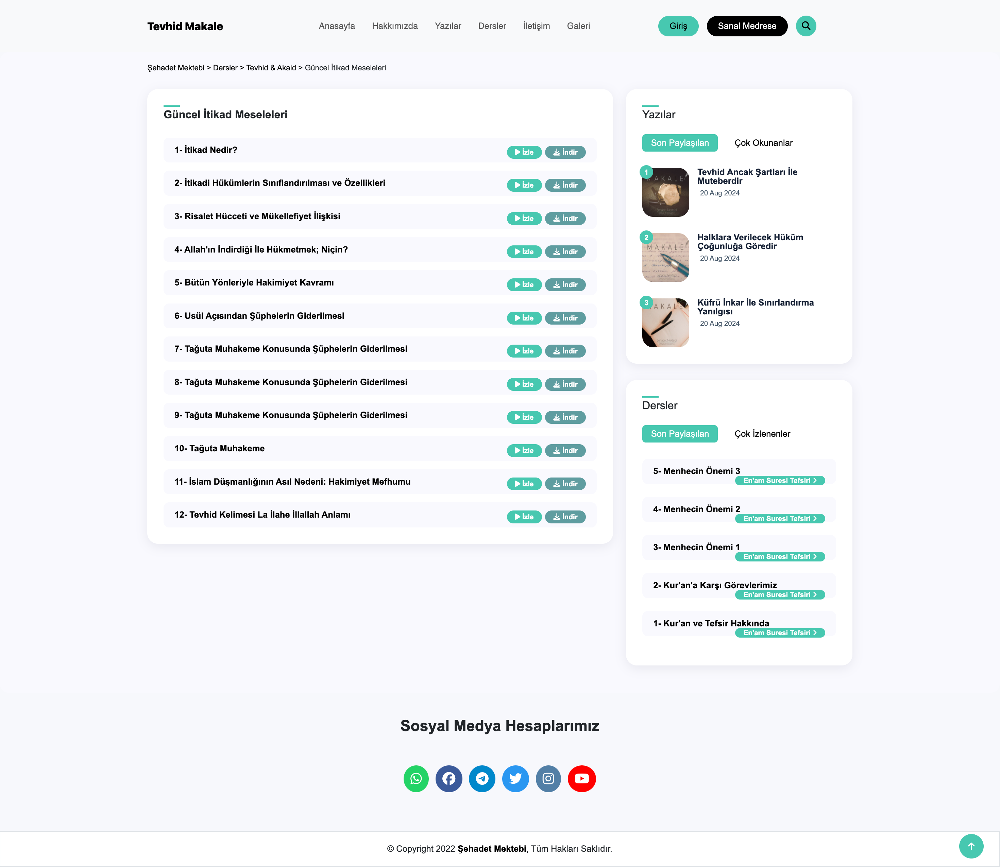
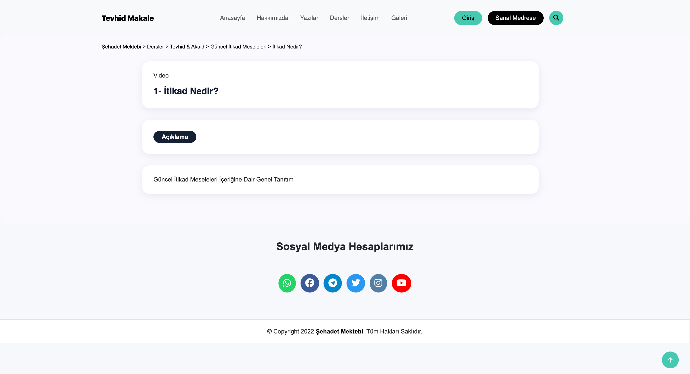
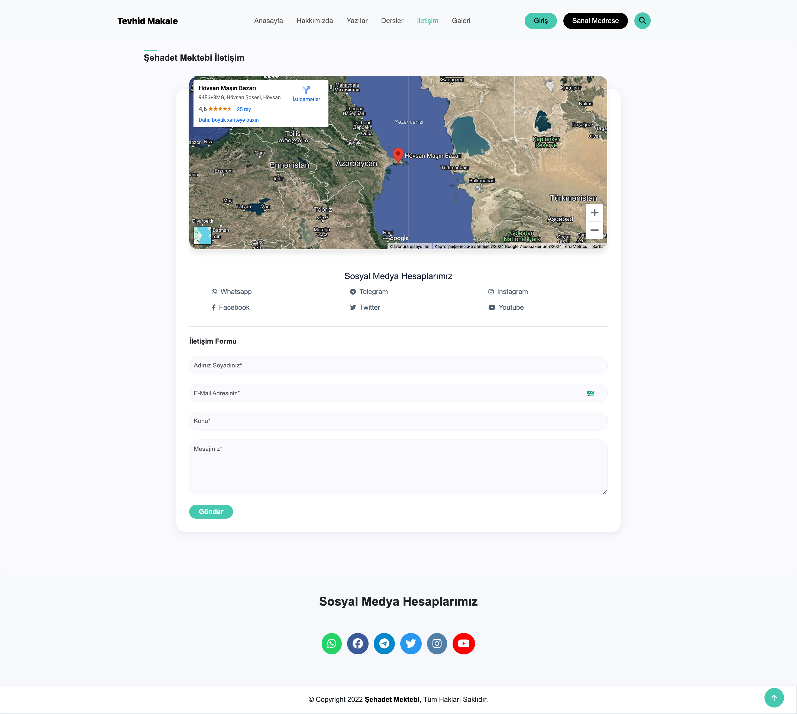

# Tevhid-Dergisi

    <h1>Home</h1>
    
     
     
    <h1>About</h1>
    
     
     
    <h1>Articles</h1>
    
     
     
    <h1>Article Categories</h1>
    
     
     
    <h1>Article Details</h1>
    
     
     
    <h1>Lesson Section</h1>
    
     
     
    <h1>Lesson Topic</h1>
    
     
     
    <h1>Lessons</h1>
    
     
     
    <h1>Lesson Video</h1>
    
     
     
    <h1>Galery Page</h1>
    
     
     
    <h1>Contact Page</h1>
    
     
     
     
     

### Kullanılan teknolojiler

    
     
     
     
    

   
 
 
    

### Kullanılan teknolojiler 
-  **HTML**
-  **CSS**
-  **JavaScript**
-  **Bootstrap**
-  **Python**
-  **Django**
-  **PostgreSQL**
